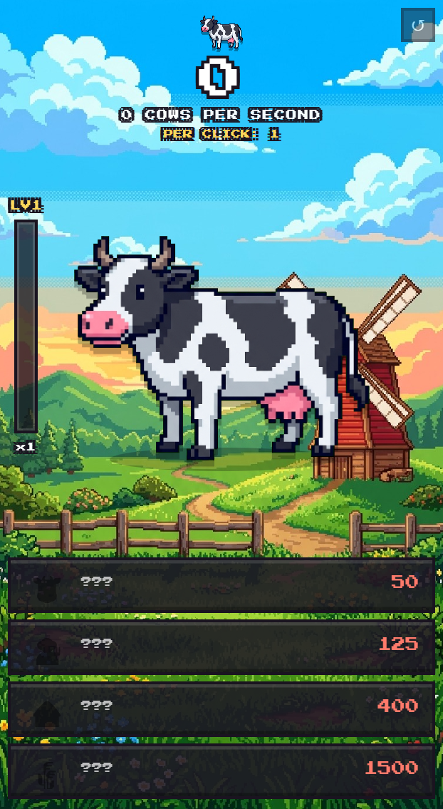
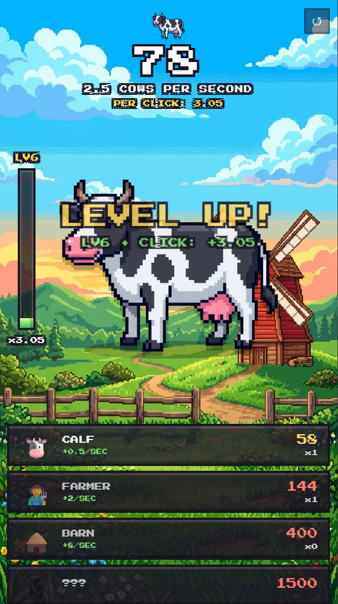

# 🐮 Cow Clicker (Cow Game)

A cozy, retro 16-bit pixel-art desktop clicker game built with Electron and web technologies.

🔗 **GitHub Repository:** [https://github.com/Nwexy/Cow-Game](https://github.com/Nwexy/Cow-Game)

---

## 📸 Screenshots

| Screenshot 1 | Screenshot 2 |
| :---: | :---: |
|  |  |

---

## 🎮 Game Features & Mechanics

- **Portrait Window Mode:** Fixed 420x760 vertical PC window format with a clean frameless feel.
- **Clicking:** Click the cow using your mouse (Left Click) or press the **Spacebar** on your keyboard.
- **Level & Multiplier System:**
  - Level up for every **50 points** earned.
  - Each level increases your click power by **1.25x** (`1 -> 1.25 -> 1.56 -> 1.95...`).
  - Vertical pixel-art progress bar on the left tracks your progress toward the next level.
- **Shop & Passive Income (Cows Per Second):**
  - 🐮 **Calf:** +0.5 cows/sec
  - 👨‍🌾 **Farmer:** +2 cows/sec
  - 🛖 **Barn:** +8 cows/sec
  - 🌾 **Windmill:** +30 cows/sec
- **Retro Audio & Visual Effects:** 8-bit sound synthesizers generated with Web Audio API, bouncy animations, and particle bursts.
- **Autosave:** Your progress is saved automatically. You can reset your progress anytime using the **↺** button in the top-right corner.

---

## 🚀 How to Play

### 1. Standalone Executable (Windows)
Simply run the portable executable:
```text
CowClicker.exe
```
No installation, browser, or dependencies required!

### 2. Run from Source Code (Developer Mode)
Prerequisites: [Node.js](https://nodejs.org/) (v18+)

```bash
# Install dependencies
npm install

# Run the game in development mode
npm start

# Build a standalone Windows executable (.exe)
npm run dist
```

---

## 📄 License & Credits
Created by [Nwexy](https://github.com/Nwexy). Released under the ISC License.
